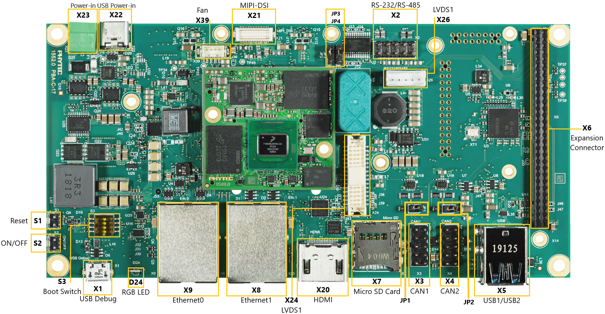

Installation
============

Product : Imx8mp 
-----------------

The first step is to setup the device. For that you need: 

* SD Card (and an adaptator if needed for your computer)
* power adapter +24V
* Ethernet cable 
* USB-A to USB-B Micro Cable 
* [optional] USB camera (WebCam)

For the display, you have two choices:

* HDMI cable with basic screen 
* LVSD screen with cables 

To setup the board, do the following :

The first step is to check that the Boot Mode DIP Switch (S3) is set to "SD Card" as follow:

.. image:: ../images/SD_Card_Boot.png
  :width: 100
  :alt: board-front
  :align: center

Once it's done, you can continue with the following steps: 

#. Connect the USB cable to your host PC and the Debug FTDI (X1).
#. Insert the Micro SD Card inside the board (X7).
#. Power up the phyCORE-i.MX 8M Plus.
#. Connect the power adapter (+24 V DC) to the power supply connector (X23).
#. Turn your power supply on.

For more information on how to setup the board, please refer to `this document for the i.MX8MP product <https://www.phytec.de/fileadmin/phytec_base/images/01-Produkte/Component-Placement/L1025e.A0-phyBOARD-Pollux_iMX8M-Plus_web.pdf>`_.

Downloading a bootable image in the sd card 
--------------------------------------------

The first step is to download the new image and copy it on the SD card. To do that use the following command: 

.. code-block:: bash

    wget my_image_url.de 

You should have in your folder a file named :code:`my_image_url`. 

Everything you need for this tutorial is installed on this image already. 
If you want to personalize the image or add new package using yocto, you can see how to do it with the First steps with Yocto (link).

Once the file is downloaded on your computer, you need to copy it on the sd card. 
To do that, you first need to find the name of your sd card.

On linux, you have two ways to find the name of your sd card: :code:`dmseg` or comparing the :code:`/dev` folder on linux before and after pluging the SD Card to the computer.

Once you have the name of your sd card (for example :code:`mmcblk0`), you need to unmount the partitions. The name of partitions is as follow `/dev/mmcblk0p1` with `p1` indicating the first partition. 
To unmount a partition use the following command: 

.. code-block:: bash

    unmount /dev/mmcblk0p1

Once **ALL** you partitons are removed, you can copy the image using the dd command:

.. code-block:: bash

    sudo dd if=my_image_url.wic of=/dev/mmcblk0 bs=1M conv=fsync status=progress

..     Be very careful when selecting the right drive for the sd card ! 

..     Selecting the wrong drive can erase your hard drive! The parameter conv=fsync forces a data buffer to write to the device before dd returns.

.. note::
   This is note text. Use a note for information you want the user to
   pay particular attention to.

   If note text runs over a line, make sure the lines wrap and are indented to
   the same level as the note tag. If formatting is incorrect, part of the note
   might not render in the HTML output.

   Notes can have more than one paragraph. Successive paragraphs must
   indent to the same level as the rest of the note.

Your SD Card is now ready to be used !

Getting connected to the target
-------------------------------

Serial connection
*****************

Add the sd card to the board and power it. 
You should see the Linux Logo and then the kivy demo starting. 

If you want to connect to the target (the board) you can do that via the serial connection. 

First, install tio with the following command: 

.. code-block:: bash

    sudo apt install tio

Then launch: 

.. code-block:: bash

    tio /dev/ttyUSB<num>

You need to replace the <num> part by the good USB number. 

You should then access the board and be able to the the following line 
    First line on the board 

The password is `root` when developping. 

You can then play with your device ! 

Ethernet connection
*******************

We recommend disconnecting your host-PC from any other network, because a peer to-peer
connection from your PC to the phyCORE-i.MX 8M Mini Plus will be established.
1. Connect your preferred Ethernet interface on your PC with RJ45 connector X8 (ETH1)
on the phyCORE-i.MX 8M Plus using the included Ethernet cable.
2. Configure the IP-settings on your host platform in Ubuntu:
• In the Unity-panel (left side of your desktop) click on the Ubuntu logo (topmost icon).
• The Ubuntu dashboard will open; enter System Settings in the search field (you will
see the corresponding icon showing up already during typing of the search string).
• Open System Settings and click on the Network icon.
• Select the physical interface to which you have connected the Ethernet cable
(if you have more than one network in the list) and click on Options.
• Select the IPv4Settings (E) tab and choose Manual (F) in the Method drop down box.
• Click Add (G) and enter the IP address 192.168.3.10 (H) and 255.255.255.0
as subnet mask (I) and 192.168.3.10 as gateway (J).
• Last, click on Save (K) to save these connection settings and close the windows.
You are now ready to test the Ethernet network connection.
3. Click on the SSH for Target icon (L) on your desktop. A console window will open and
you will see an authentication question. Type yes and press Enter.
You are now connected to the target
(M). Congratulations!

If you do not see the user login, check the Ethernet connection between the target
and the host. Be sure that you have configured the network adapter in the virtual
machine configuration correct.

Maybe try to ping to be sure everything is working fine !

Next steps
----------

You can for example try: python3, import kivy. 
And follow how to download the image with kivy and play with it.

.. Support
.. --------

.. If you have any question or something is not working, please contact us at the email adresse 
.. We would also very much appreciate your feedback on this documentation. You can give it to us using the following link: 

